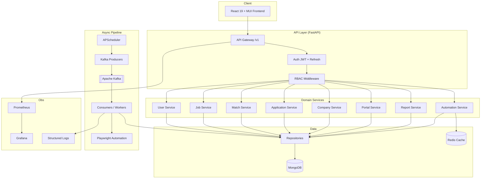
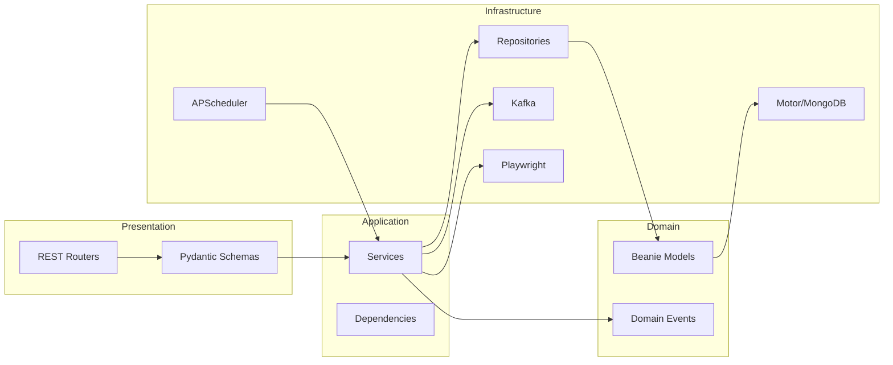
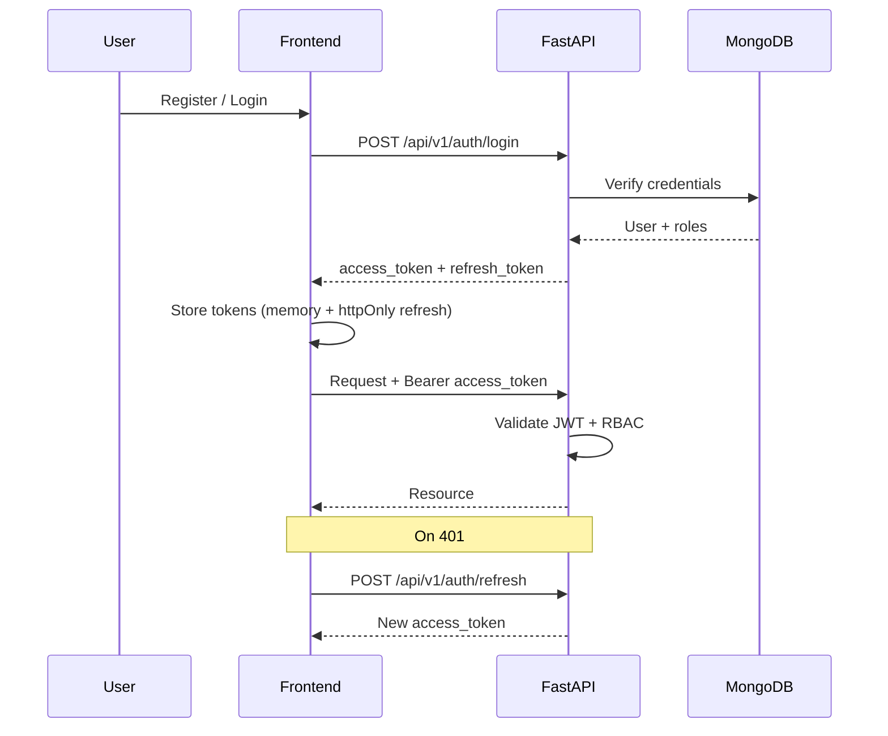
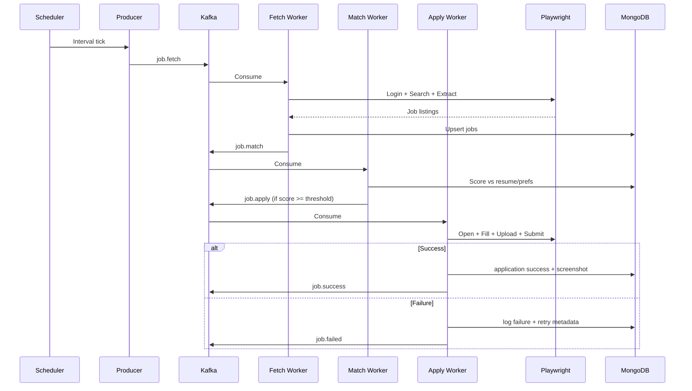
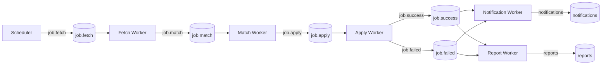

# JobPilot AI — Architecture

## Overview

JobPilot AI is a full-stack job automation platform. Users configure resumes, preferences, companies, and job portals once. The system continuously scans portals, scores matches, applies via browser automation, and surfaces analytics.

## Design Principles

- **Clean Architecture** — API → Service → Repository → Database
- **SOLID / DRY / KISS** — modular boundaries, single responsibility
- **Repository + Service Layer** — persistence isolated from business logic
- **Dependency Injection** — FastAPI `Depends` for auth, DB, services
- **Event-driven workers** — Kafka topics for fetch / match / apply / notify / report
- **Portal Adapter Pattern** — Playwright adapters per job portal

## High-Level Architecture

## Clean Architecture Layers

## Authentication Flow

## Job Automation Sequence

## Kafka Event Flow

## Module Map

| Module | Responsibility |
|--------|----------------|
| `api/v1/*` | HTTP routers, OpenAPI contracts |
| `core/` | Config, security, logging, Kafka client, exceptions |
| `models/` | Beanie documents |
| `schemas/` | Pydantic request/response DTOs |
| `repository/` | Data access (MongoDB) |
| `services/` | Business logic |
| `workers/` | Background Kafka consumers |
| `automation/` | Playwright portal adapters |
| `scheduler/` | APScheduler jobs |
| `producers/` / `consumers/` | Kafka I/O |
| `frontend/src/store/` | Redux Toolkit (JS) global UI state |

## Scalability Notes

- Stateless API replicas behind a load balancer
- Horizontal worker scaling per Kafka consumer group
- MongoDB indexes on user_id, portal, status, fetched_at, match_score
- Redis for rate limits, session cache, and distributed locks
- Playwright workers isolated in containers with resource limits
